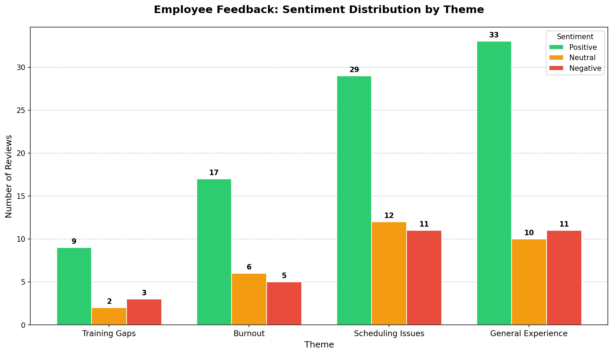
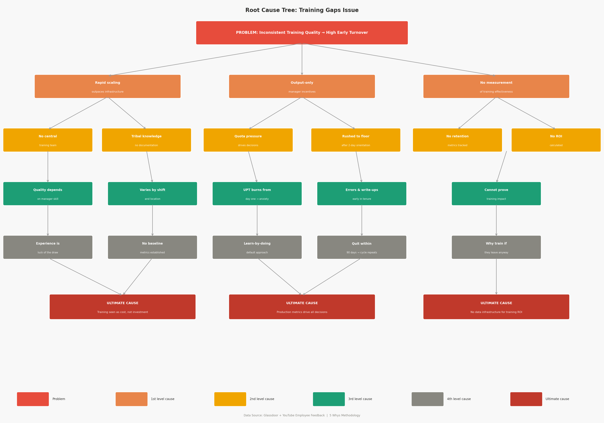

## Amazon Fulfillment Center People Analytics 👥

**Result:** Identified inconsistent training as the main driver of early attrition and proposed a low-cost, standardized onboarding solution to improve retention.

### Overview
This project analyzes early turnover among part-time associates using employee feedback from Glassdoor and YouTube. The goal was to identify root causes of attrition and recommend a scalable solution.

### Business Problem
Part-time associates leave within the first 90 days at high rates. Training is inconsistent, unstructured, and unmeasured, which leads to confusion, slower ramp-up time, and early exits.

### Data
- Employee reviews from Glassdoor  
- YouTube comment sentiment related to associate experiences  
- Training and onboarding indicators  

### Method
- Cleaned and analyzed data using Python and SQL  
- Performed sentiment analysis on external feedback sources  
- Grouped feedback into themes such as training gaps, burnout, and scheduling  
- Compared sentiment distribution across themes  

### Key Findings
- Training gaps were the only recurring issue across all feedback sources  
- 50 percent of part-time associates showed neutral or negative sentiment toward training  
- Sentiment around training was mostly neutral, which signals early concern rather than frustration  
- This creates a window to intervene before attrition increases  
- Poor onboarding contributes to slower productivity and higher turnover  

### Solution
- Designed a standardized 5-day onboarding program with clear milestones  
- Introduced Training Leads to ensure consistency and accountability  
- Created a simple tracking system to measure training completion  

### Impact
- Target 15 percent improvement in 90-day retention  
- Target 25 percent faster time to productivity  
- Estimated cost under $5,000, with positive ROI if at least two early quits are prevented

 

## Visuals

### Employee Feedback: Sentiment Distribution by Theme
> Grouped reviews from Glassdoor and YouTube across four recurring themes

  

### Root Cause Tree: Training Gaps Issue
> Analysis tracing inconsistent training quality to three structural root causes

  

